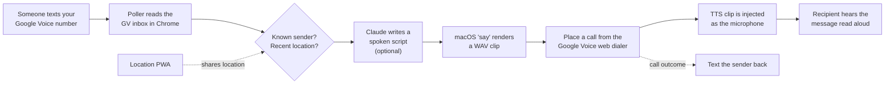

# hackathon911

Text a phone number you own, and it calls a different number you own in an AI voice that reads your message aloud. It is a stand-in for calling someone when you can only text: you text the relay, the relay calls for you.

There is **no paid telephony** (no Twilio, no per-minute fees). Calls and texts go out through **your own Google Voice account**, driven by browser automation. The only requirements are a Mac, Chrome, and a Google Voice number.

A companion **phone-login web app** lets people share their location, so when they text the relay, their last known location is spoken during the call and shown on an admin dashboard.

---

## Two ways to run it

**Relay Desk (recommended, uses your real number).** A local control panel on your Mac with an on/off toggle. While on, it watches your Messages inbox and, when someone texts you, calls a number you choose in a human voice and reads out what they need. No Google Voice, no cloud. See **Relay Desk** below.

**Google Voice relay (no second device).** Everything runs through a Google Voice number via browser automation. See **How it works** further down.

---

## Relay Desk

```
someone texts your iPhone
        v
Messages on your Mac (chat.db, read-only)   <-- toggle ON
        v
Ollama writes "This is an automated message because <sender> needs help ..."
        v
Kokoro neural TTS renders a human voice (WAV)
        v
Continuity places a real call from your iPhone to a number you choose
        v
the speech is played into the call through BlackHole (as the mic)
```

Open the panel, set who to call, flip it on. When a new text arrives it generates the script, speaks it, dials, and reads it into the call. The sender's last shared location is included when available (via the companion location app; Apple's Find My cache is encrypted and cannot be read programmatically).

### Requirements

- **macOS** with **Messages** signed in and receiving your texts (turn on Text Message Forwarding on the iPhone for SMS; iMessages arrive automatically).
- **Full Disk Access** for your terminal / the app, so it can read `~/Library/Messages/chat.db`.
- **Continuity calling**: iPhone nearby, same Apple ID, "Calls from iPhone" enabled on the Mac (FaceTime > Settings).
- **[BlackHole 2ch](https://existential.audio/blackhole/)** virtual audio device (`brew install blackhole-2ch`).
- **[Ollama](https://ollama.com)** running locally with a small model (`ollama pull llama3.2:3b` or `gemma2:2b`).
- **Kokoro TTS** (bundled setup): a Python venv under `vendor/tts` with `kokoro-onnx` plus the model files. Falls back to the macOS `say` voice if absent.
- `SwitchAudioSource` (`brew install switchaudio-osx`) for routing audio to BlackHole.

### Run

```bash
npm run desk        # opens the control panel at http://localhost:4100
```

In the panel: enter the number to call, optionally an allow-list of senders, pick a voice, and use **Hear the voice** to test without calling. Set FaceTime's microphone to **BlackHole 2ch** so the spoken audio goes into the call. Then flip the toggle **ON** and text yourself from another phone.

Only texts that arrive **after** you turn it on trigger a call. There is an hourly rate limit and an optional sender allow-list so not every message dials out.

### Sharing a texter's location

Two sources, in order:

1. **Find My.** If the texter shares their location with you in Find My, the Desk reads it straight from the Find My app. Apple encrypts the on-disk cache, so this works by automating the app via Accessibility: it pairs each friend's map pin to the nearest place label (e.g. "Washington University Field House"). It needs a one-time permission grant for the reader script, and you map a texter's number to their Find My name in the control panel. Scans are cached (~30s per scan, refreshed a few times an hour).
2. **Companion app.** If they instead share through the location app (`npm run web`, or the iOS app under `ios/`), the Desk looks that up by their number.

Either way, the call includes where they are.

---

## How it works



1. **Inbound text.** Anyone texts your Google Voice number.
2. **Poll.** A Node service drives a logged-in Chrome (Playwright, persistent profile) and reads unread inbound threads from the GV inbox.
3. **Script.** The text is turned into a natural spoken script by Claude (`claude-opus-5` by default). Without an API key it falls back to reading the message verbatim after a fixed intro. If the sender has shared a recent location, it is read out too.
4. **Speech.** The script is synthesized to a WAV with the built-in macOS `say` command (free, offline).
5. **Call.** The service places a call from the Google Voice web dialer to your target number. The trick that makes audio work with no virtual sound devices: the page's `getUserMedia` is overridden so a Web Audio destination becomes the microphone, and the TTS clip is played into it. The recipient hears the message; the clip repeats a configurable number of times, then the call hangs up.
6. **Notify.** When the call ends, the original sender gets a text with the outcome (delivered / no answer / busy / failed).

The relay is stateless per message: everything needed for a call is computed at poll time and stored in SQLite.

---

## The location app

A small installable web app (`/`) lets people sign in **with their phone number**:

- Enter number, receive a 6-digit code (texted from your Google Voice number), verify.
- While the page is open it streams the device location (`watchPosition` plus a 60-second heartbeat) to the server.
- That location is stored per user, spoken during a relay call from that number, and shown on the dashboard.

An admin **dashboard** (`/dashboard`, protected by an admin token) shows every relayed text with its call outcome and the sender's location at the time, plus each signed-in user's last known position with Google Maps links.

Note: browsers cannot share location from a background web page, so tracking only happens while the app is open. "Add to Home Screen" keeps it handy.

---

## Stack

- **Node 24 + TypeScript** (ESM, run directly with `tsx`)
- **Playwright** driving Chrome for all Google Voice interaction
- **Express** for the web app / dashboard / API
- **@anthropic-ai/sdk** for script generation (optional)
- **node:sqlite** for storage (users, sessions, locations, messages)
- **macOS `say`** for text-to-speech
- **OpenStreetMap Nominatim** for free reverse geocoding

---

## Setup

Requirements: macOS, Google Chrome, Node 24+, and a Google Voice number.

```bash
npm install

# 1. Sign in to Google Voice once. A Chrome window opens; sign in to the
#    account that owns your GV number. The session is saved to .chrome-profile.
npm run login

# 2. Configure. Copy the template and fill it in.
cp .env.example .env
#    Required: TARGET_PHONE_NUMBER (the number to call), ADMIN_TOKEN.
#    Optional: ANTHROPIC_API_KEY for Claude-written scripts.

# 3. In Google Voice settings, set calls to be made in the browser
#    (the "make calls in your browser" option), so calls go out over the web.
```

## Running

```bash
# Full relay + web app + dashboard. caffeinate keeps the Mac awake for calls.
caffeinate -i npm start

# Expose the app to phones (for the location PWA). Put the URL in PUBLIC_BASE_URL.
npm run tunnel
```

Then text your Google Voice number from any phone. It will call your target number and read the message.

- App: `http://localhost:3000/`
- Dashboard: `http://localhost:3000/dashboard` (paste your `ADMIN_TOKEN`)

### Run just the app (no Google Voice)

```bash
npm run web   # login / location / dashboard only; verification codes are printed to the log
```

---

## Scripts

| Command | What it does |
|---|---|
| `npm start` / `npm run dev` | Run the full relay, web app, and dashboard |
| `npm run web` | Run only the web app/dashboard (codes logged, no GV) |
| `npm run login` | One-time Google Voice sign-in into the automation profile |
| `npm run tunnel` | Expose port 3000 via ngrok |
| `npm run gv:dryrun` | Exercise the GV inbox/compose/dialer live, stopping before any real send or call |
| `npm run gv:inspect` | Dump the Google Voice accessibility tree for tuning selectors |
| `npm run test:call -- "text"` | Place a real call to `TARGET_PHONE_NUMBER` reading the text |
| `npm run test:sms -- +1555... "text"` | Send a real text from your GV number |
| `npm run typecheck` | Type-check without emitting |
| `npm test` | Run the unit tests (`node:test`) |

---

## Configuration

All configuration is via `.env` (see `.env.example`).

| Variable | Required | Description |
|---|---|---|
| `TARGET_PHONE_NUMBER` | yes | E.164 number the relay calls and reads the message to |
| `ADMIN_TOKEN` | yes | 12+ char secret protecting `/dashboard` and `/api/admin/*` |
| `GV_PHONE_NUMBER` | no | Your Google Voice number (shown in the app as "text us at") |
| `PUBLIC_BASE_URL` | no | Public URL phones use to reach the app (your ngrok URL) |
| `ANTHROPIC_API_KEY` | no | Enables Claude-written scripts; omit for the verbatim template |
| `ANTHROPIC_MODEL` | no | Defaults to `claude-opus-5` |
| `TTS_VOICE` | no | Any macOS `say` voice (default `Samantha`); `say -v '?'` lists them |
| `CHROME_PROFILE_DIR` | no | Automation profile dir (default `.chrome-profile`) |
| `HEADLESS` | no | Run Chrome headless (default `false`) |
| `PORT` | no | Web server port (default `3000`) |
| `POLL_INTERVAL_MS` | no | Inbox poll interval (default `4000`) |
| `CALL_ANSWER_TIMEOUT_MS` | no | How long to wait for an answer (default `45000`) |
| `CALL_REPEAT` | no | Times to read the message per call (default `2`) |
| `LOCATION_MAX_AGE_MS` | no | Oldest location to speak in a call (default 24h) |
| `RELAY_SPAM` | no | Relay threads Google flags as spam (default `false`) |
| `RELAY_PREEXISTING` | no | Relay unread texts that existed before startup (default `false`) |

---

## Project layout

```
src/
  config.ts        env loading + validation
  logger.ts        timestamped structured logging
  phone.ts         phone number normalization to E.164
  db.ts            SQLite store (users, sessions, locations, messages)
  tts.ts           macOS say -> WAV
  geocode.ts       OpenStreetMap reverse geocoding
  script.ts        SMS -> spoken script (Claude, template fallback)
  relay.ts         orchestrates inbox -> location -> script -> TTS -> call
  main.ts          the service loop + browser watchdog
  web-only.ts      app/dashboard without Google Voice
  gv/
    browser.ts     persistent Chrome + microphone injection
    session.ts     single-tab operation queue
    inbox.ts       read unread inbound threads
    caller.ts      dial and play the message
    sms.ts         send a text through the composer
  web/
    server.ts      login / location / admin API
public/            the phone-login PWA and admin dashboard
scripts/           login, inspection, dry-run, and manual test tools
test/              unit tests (node:test)
```

---

## How the storage is used

SQLite (`relay.sqlite`, gitignored) holds:

- **users / verifications / sessions** — phone-number login with code throttling and attempt lockout.
- **locations** — every location ping, queried for the latest per user.
- **messages** — every relayed text with its call status, so the dashboard can show history and duplicates are never called twice.

---

## Limitations and notes

- **macOS only** — text-to-speech uses the built-in `say` command.
- **The Mac must stay awake and signed in to Google Voice** for the relay to run. `caffeinate -i` helps.
- **Google Voice has no public API**, so the integration scrapes its web UI. Google can change the DOM; `npm run gv:inspect` and `npm run gv:dryrun` exist to re-tune the selectors quickly.
- **Location is only shared while the app is open** (a browser limitation).
- **One target number** per instance — the relay always calls `TARGET_PHONE_NUMBER`.
- Use this only for numbers you own and people who have opted in.

---

## Testing

```bash
npm run typecheck
npm test          # 25 unit tests across phone, db, tts, script, inbox, relay, and the web API
```

The GV browser paths are verified end-to-end with `npm run gv:dryrun`, which reads the live inbox and walks the compose and dialer flows without actually sending or calling.
